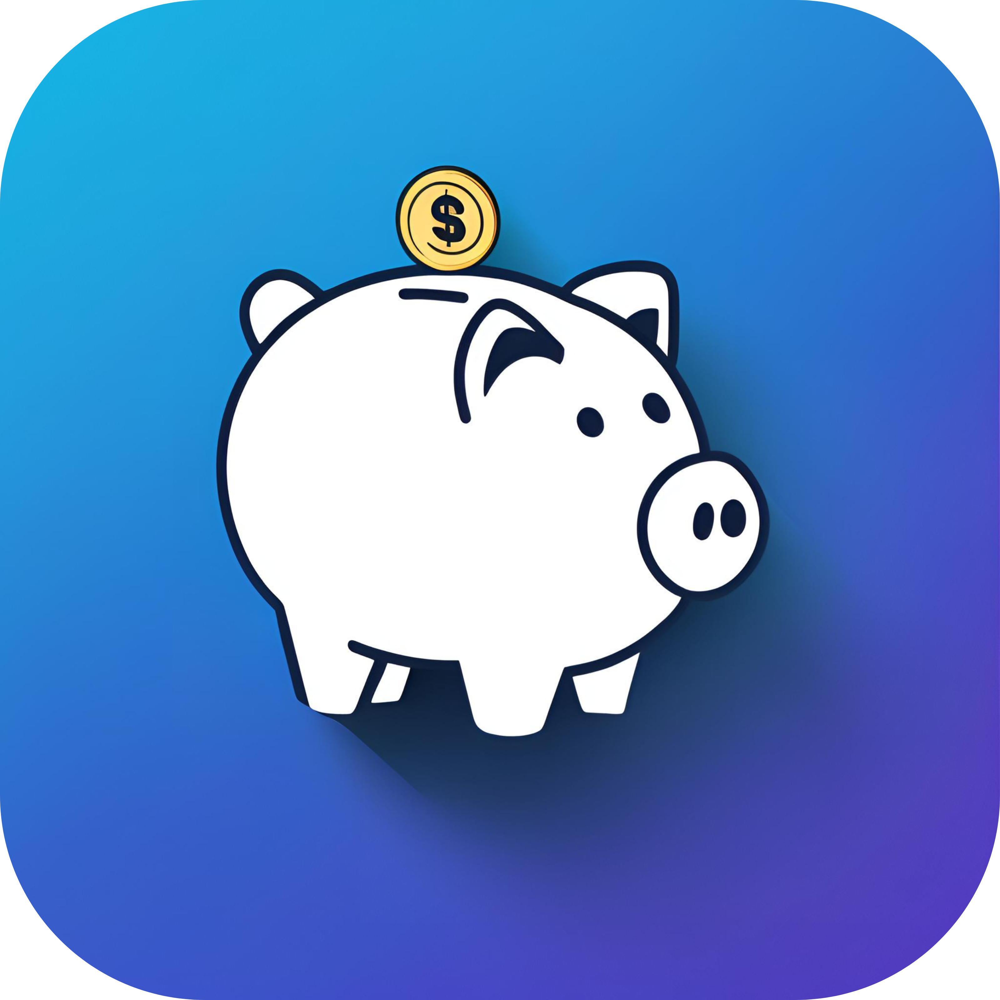

  
  <h2>Follow Manager for GitHub</h2>
  
EasyBudget is a user-friendly iOS application designed to help you take control
of your finances. With its intuitive interface and powerful features, you can
easily track your spending, analyze your expenses by category, and gain valuable
insights into your financial habits..

## Screenshots

| Main View                                                                                     | Expenses                                                                                     | Categories                                                                                     | Settings                                                                                     | Statistics                                                                                     |
| --------------------------------------------------------------------------------------------- | -------------------------------------------------------------------------------------------- | ---------------------------------------------------------------------------------------------- | -------------------------------------------------------------------------------------------- | ---------------------------------------------------------------------------------------------- |
|  |  |  |  |  |

## Features

- 📊 Simple and intuitive expense tracking
- 🗂️ Categorized spending analysis
- 💰 Monthly budget overview
- 📈 Visual spending insights
- 🔒 Secure data storage
- 🌙 Dark mode support
- 📱 Optimized for iPhone using native language

## Requirements

- iOS 15.6 or newer
- Available on the [App Store](https://apps.apple.com/se/app/easybudget/id6446150580?l=en-GB)

## Getting Started

1. Download EasyBudget from the App Store
2. Launch the app and start tracking your expenses
3. Categorize your spending to gain insights
4. Monitor your monthly budget and savings

## Support

If you have any questions, suggestions, or need to report an issue, please
contact the developer at:

- Email: kiko.devv@gmail.com

## Version History

- 3.0 Introducing a complete app overhaul with Swedish language support,
  Enhanced performance and Modernized design
- 2.1 - Latest version with improved performance and stability
- 2.0 - Major update with enhanced features
- 1.0 - Initial release

## 🔒 Privacy
EasyBudget respects your privacy. All your financial data is stored locally on
your device and is not shared with any third parties.

## 📝 License

Kiko.devv@gmail.com

